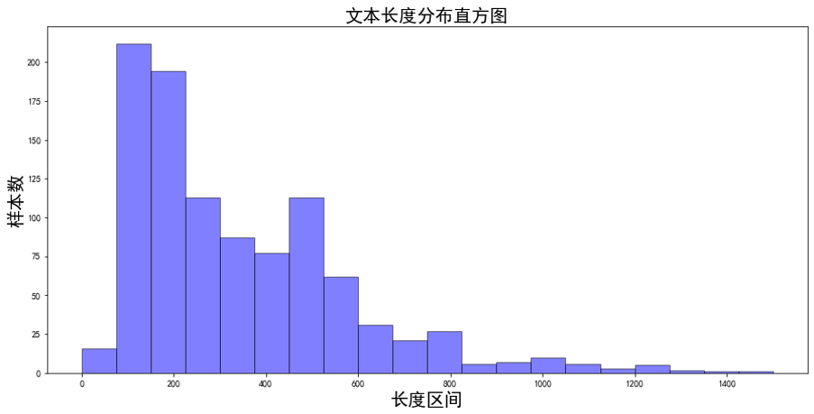
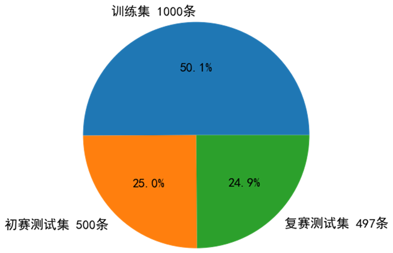
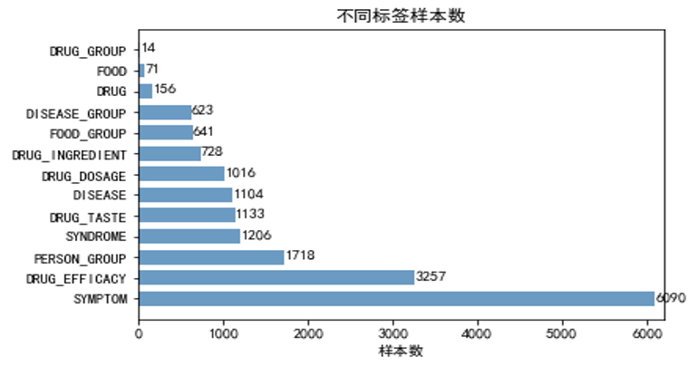
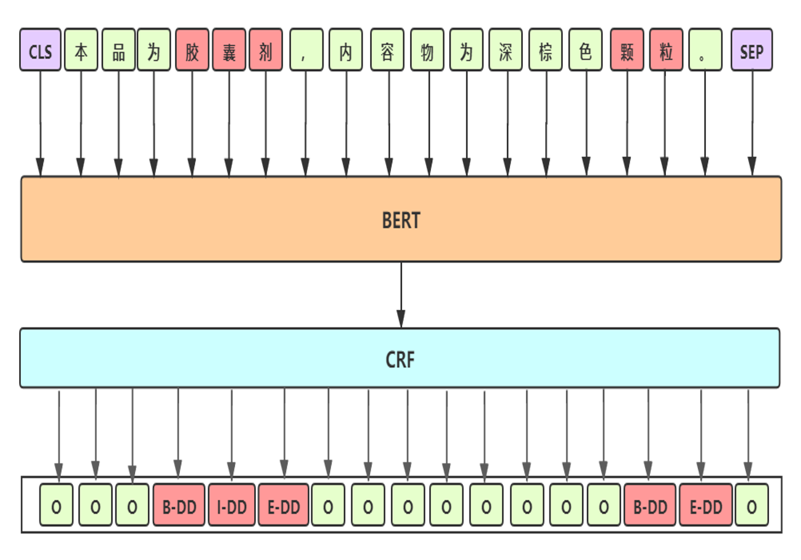
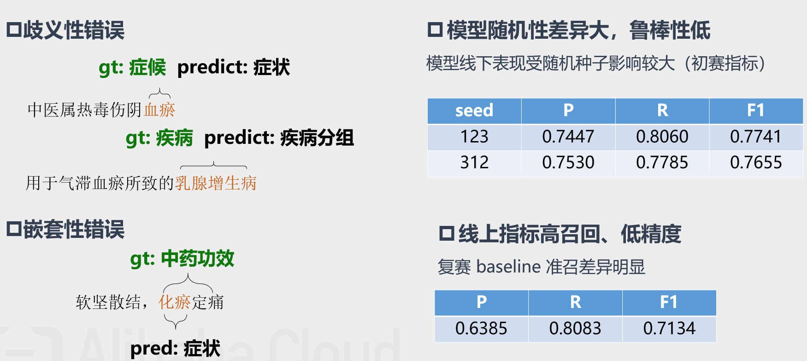
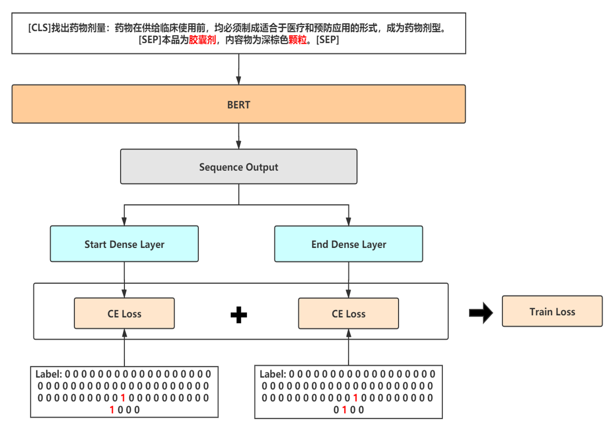
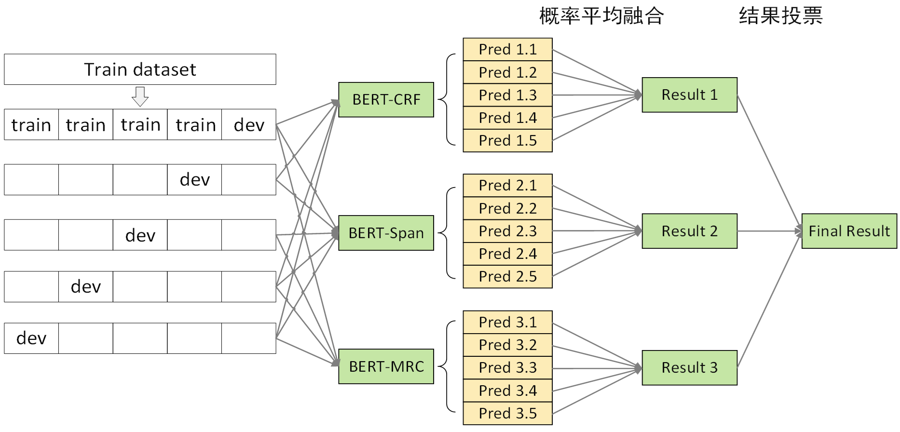
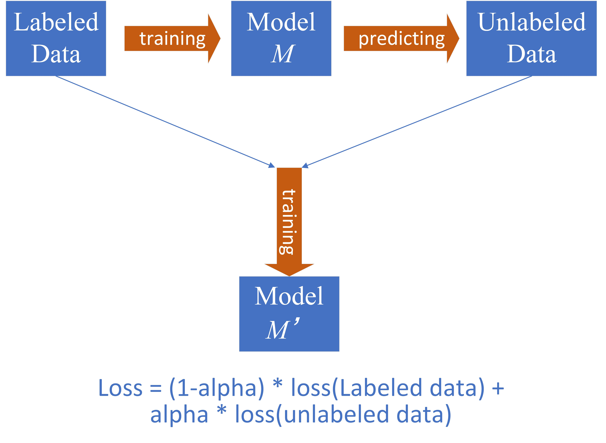

# Chinese-DeepNER-Pytorch

## 天池中药说明书实体识别挑战冠军方案开源

### 贡献者:
zxx飞翔的鱼: https://github.com/z814081807

我是蛋糕王：https://github.com/WuHuRestaurant

数青峰：https://github.com/zchaizju

### 后续官方开放数据集后DeepNER项目会进行优化升级，包含完整的数据处理、训练、验证、测试、部署流程，提供详细的代码注释、模型介绍、实验结果，提供更普适的基于预训练的中文命名实体识别方案，开箱即用，欢迎Star!

（代码框架基于**pytorch and transformers**, 框架**复用性、解耦性、易读性**较高，很容易修改迁移至其他NLP任务中）

## 环境

```python
python3.7
pytorch==1.6.0 +
transformers==2.10.0
pytorch-crf==0.7.2
```

## 项目目录说明

```shell
DeepNER
│
├── data                                    # 数据文件夹
│   ├── mid_data                            # 存放一些中间数据
│   │   ├── crf_ent2id.json                 # crf 模型的 schema
│   │   └── span_ent2id.json                # span 模型的 schema
│   │   └── mrc_ent2id.json                 # mrc 模型的 schema
│
│   ├── raw_data                            # 转换后的数据
│   │   ├── dev.json                        # 转换后的验证集
│   │   ├── test.json                       # 转换后的初赛测试集
│   │   ├── pseudo.json                     # 转换后的半监督数据
│   │   ├── stack.json                      # 转换后的全体数据
│   └── └── train.json                      # 转换后的训练集
│
├── out                                     # 存放训练好的模型
│   ├── ...           
│   └── ...                                      
│
├── src
│   ├── preprocess                  
│   │   ├── convert_raw_data.py             # 处理转换原始数据
│   │   └── processor.py                    # 转换数据为 Bert 模型的输入
│   ├── utils                      
│   │   ├── attack_train_utils.py           # 对抗训练 FGM / PGD
│   │   ├── dataset_utils.py                # torch Dataset
│   │   ├── evaluator.py                    # 模型评估
│   │   ├── functions_utils.py              # 跨文件调用的一些 functions
│   │   ├── model_utils.py                  # Span & CRF & MRC model (pytorch)
│   │   ├── options.py                      # 命令行参数
│   |   └── trainer.py                      # 训练器
|
├── competition_predict.py                  # 复赛数据推理并提交
├── README.md                               # ...
├── convert_test_data.py                    # 将复赛 test 转化成 json 格式
├── run.sh                                  # 运行脚本
└── main.py                                 # main 函数 （主要用于训练/评估）
```

## 使用说明

### 预训练使用说明

* 腾讯预训练模型 Uer-large（24层）： https://github.com/dbiir/UER-py/wiki/Modelzoo

* 哈工大预训练模型 ：https://github.com/ymcui/Chinese-BERT-wwm

  百度云下载链接：

  链接：https://pan.baidu.com/s/1axdkovbzGaszl8bXIn4sPw 
  提取码：jjba 

  （注意：需人工将 vocab.txt 中两个 [unused] 转换成 [INV] 和 [BLANK]）
  
  tips: 推荐使用 uer、roberta-wwm、robert-wwm-large

### 数据转换

**注：已提供转换好的数据 无需运行**

```python
python src/preprocessing/convert_raw_data.py
```

### 训练阶段

```shell
bash run.sh
```

**注：脚本中指定的 BERT_DIR 指BERT所在文件夹，需要把 BERT 下载到指定文件夹中**

##### BERT-CRF模型训练 

```python
task_type='crf'
mode='train' or 'stack'  train:单模训练与验证 ； stack:5折训练与验证

swa_start: swa 模型权重平均开始的 epoch
attack_train： 'pgd' / 'fgm' / '' 对抗训练 fgm 训练速度慢一倍, pgd 慢两倍，pgd 本次数据集效果明显
```

##### BERT-SPAN模型训练 

```python
task_type='span'
mode：同上
attack_train: 同上
loss_type: 'ce'：交叉熵; 'ls_ce'：label_smooth; 'focal': focal loss
```

##### BERT-MRC模型训练 

```python
task_type='mrc'
mode：同上
attack_train: 同上
loss_type: 同上
```

### 预测复赛 test 文件 （上述模型训练完成后）

**注：暂无数据运行，等待官方数据开源后可运行**

```shell
# convert_test_data
python convert_test_data.py
# predict
python competition_predict.py
```

# 赛题背景
## 任务描述
人工智能加速了中医药领域的传承创新发展，其中中医药文本的信息抽取部分是构建中医药知识图谱的核心部分，为上层应用如临床辅助诊疗系统的构建（CDSS）等奠定了基础。本次NER挑战需要抽取中药药品说明书中的关键信息，包括药品、药物成分、疾病、症状、证候等13类实体，构建中医药药品知识库。

## 数据探索分析
本次竞赛训练数据有三个特点：

 - 中药药品说明书以长文本居多
 
 - 医疗场景下的标注样本不足

 - 标签分布不平衡


# 核心思路
## 数据预处理
首先对说明书文本进行预清洗与长文本切分。预清洗部分对无效字符进行过滤。针对长文本问题，采用两级文本切分的策略。切分后的句子可能过短，将短文本归并，使得归并后的文本长度不超过设置的最大长度。此外，利用全部标注数据构造实体知识库，作为领域先验词典。

## Baseline: BERT-CRF


 - Baseline 细节
	- 预训练模型：选用 UER-large-24 layer[1]，UER在RoBerta-wwm 框架下采用大规模优质中文语料继续训练，CLUE 任务中单模第一
	- 差分学习率：BERT层学习率2e-5；其他层学习率2e-3
	- 参数初始化：模型其他模块与BERT采用相同的初始化方式
	- 滑动参数平均：加权平均最后几个epoch模型的权重，得到更加平滑和表现更优的模型
- Baseline bad-case分析


## 优化1：对抗训练
- 动机：采用对抗训练缓解模型鲁棒性差的问题，提升模型泛化能力
- 对抗训练是一种引入噪声的训练方式，可以对参数进行正则化，提升模型鲁棒性和泛化能力
	- Fast Gradient Method (FGM)：对embedding层在梯度方向添加扰动
	- Projected Gradient Descent (PGD) [2]：迭代扰动，每次扰动被投影到规定范围内

## 优化2：混合精度训练（FP16）
- 动机：对抗训练降低了计算效率，使用混合精度训练优化训练耗时
- 混合精度训练
	- 在内存中用FP16做存储和乘法来加速
	- 用FP32做累加避免舍入误差
- 损失放大
	- 反向传播前扩大2^k倍loss，防止loss下溢出
	- 反向传播后将权重梯度还原

## 优化3：多模型融合
- 动机：baseline  错误集中于歧义性错误，采用多级医学命名实体识别系统以消除歧义性
- 方法：差异化多级模型融合系统
	- 模型框架差异化：BERT-CRF  &  BERT-SPAN & BERT-MRC
	- 训练数据差异化：更换随机种子、更换句子切分长度（256、512）
	- 多级模型融合策略

- 融合模型1——BERT-SPAN
	- 采用SPAN指针的形式替代CRF模块，加快训练速度
	- 以半指针-半标注的结构预测实体的起始位置，同时标注过程中给出实体类别
	- 采用严格解码形式，重叠实体选取logits最大的一个，保证准确率
	- 使用label smooth缓解过拟合问题


- 融合模型2——BERT-MRC
	- 基于阅读理解的方式处理NER任务
		- query：实体类型的描述来作为query
		- doc：分句后的原始文本作为doc
	- 针对每一种类型构造一个样本，训练时有大量负样本，可以随机选取30%加入训练，其余丢弃，保证效率
	- 预测时对每一类都需构造一次样本，对解码输出不做限制，保证召回率
	- 使用label smooth缓解过拟合问题
	- MRC在本次数据集上精度表现不佳，且训练和推理效率较低，仅作为提升召回率的方案，提供代码仅供学习，不推荐日常使用


- 多级融合策略
	- CRF/SPAN/MRC 5折交叉验证得到的模型进行第一级概率融合，将 logits 平均后解码实体
	- CRF/SPAN/MRC 概率融合后的模型进行第二级投票融合，获取最终结果


## 优化4：半监督学习
- 动机：为了缓解医疗场景下的标注语料稀缺的问题， 我们使用半监督学习（伪标签）充分利用未标注的500条初赛测试集
- 策略：动态伪标签
	- 首先使用原始标注数据训练一个基准模型M
	- 使用基准模型M对初赛测试集进行预测得到伪标签
	- 将伪标签加入训练集，赋予伪标签一个动态可学习权重（图中alpha），加入真实标签数据中共同训练得到模型M’

	- tips：使用多模融合的基准模型减少伪标签的噪音；权重也可以固定，选取需多尝试哪个效果好，本质上是降低伪标签的loss权重，是缓解伪标签噪音的一种方法。	

## 其他无明显提升的尝试方案
- 取BERT后四层动态加权输出，无明显提升
- BERT 输出后加上BiLSTM  /  IDCNN 模块，过拟合严重，训练速度大大降低
- 数据增强，对同类实体词进行随机替换，以扩充训练数据
- BERT-SPAN  /  MRC 模型采用focal loss  /  dice  loss  等缓解标签不平衡
- 利用构造的领域词典修正模型输出

## 最终线上成绩72.90%，复赛Rank 1，决赛Rank 1


# Ref
[1] Zhao et al., UER: An Open-Source Toolkit for Pre-training Models, EMNLP-IJCNLP, 2019.
[2] Madry et al., Towards Deep Learning Models Resistant to Adversarial Attacks, ICLR, 2018.
